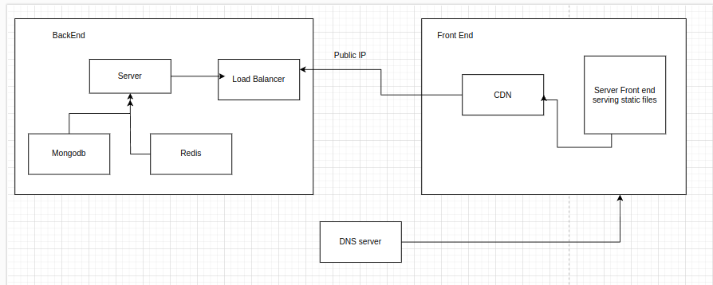

1. Architecture:

2. Step to run BE:
   1. CD into BE
   2. docker-compose up -d
   3. change env if needed
   4. npm run start

3. Step to run FE:
   1. CD into FE
   2. change env to local IP of the server
   3. npm run start
   4. Go to add more question to add question
   5. When you click submit question, question is broadcast to subscribers via websocket
   6. Answer questions, results are updated real time by websocket
